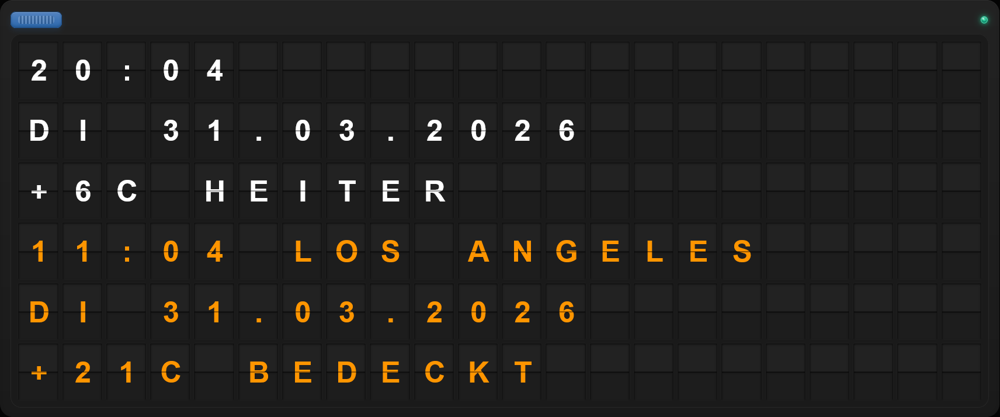

[README.md](https://github.com/user-attachments/files/26383631/README.md)
# **Split-Flap Board**

A virtual replica of a split-flap board, like the ones you might know from airports or train stations. Beautifully recreated with skeuomorphic design elements.
Including proper character sequenz and realistic flip sound.

##### *Features:*

**Weather** at your location or where ever you want on the planet.

**Dual-Time** to keep track of the time around the world.

**Custom Messages** for your thoughts.

**Fullscreen** for the full experience. And of course: *Safe for **OLED*** thanks to integrated mechanism.

**Dark/Light Mode** - adaptive.
